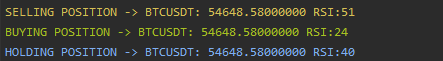

# Robin Hood

Binance Otomatik Al-Sat yapan yardımcı yazılımdır.


Kurulum:
```sh
git clone https://github.com/burakerenel/robinhood
cd robinhood && composer install
```

.env.example dosyasının kopyalayarak .env yapın.
API bilgilerini ve mysql bilgilerini girin.

Daha sonra terminalden alağıdaki komutu girin.

```sh
php artisan key:generate
php artisan migrate
```


# Çalıştırmak İçin

```sh
php artisan robin:start
```




